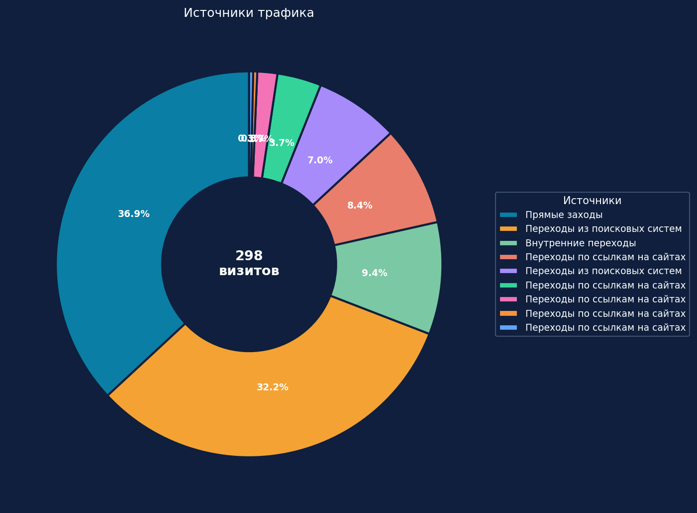
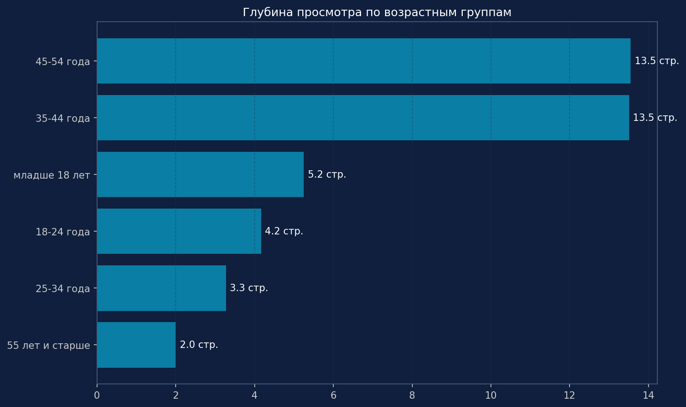
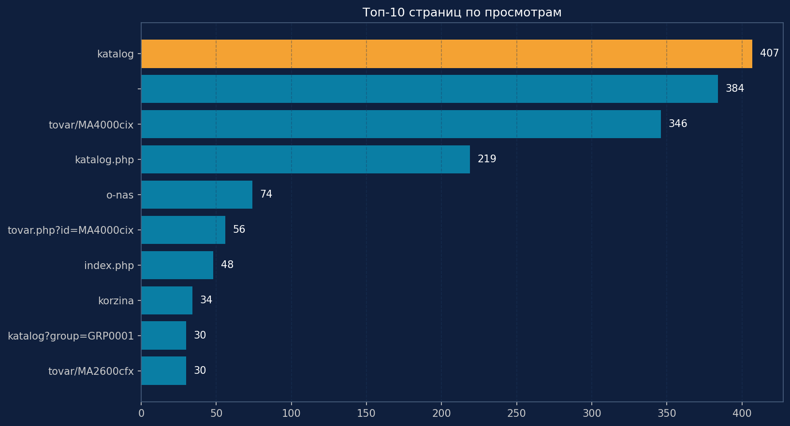
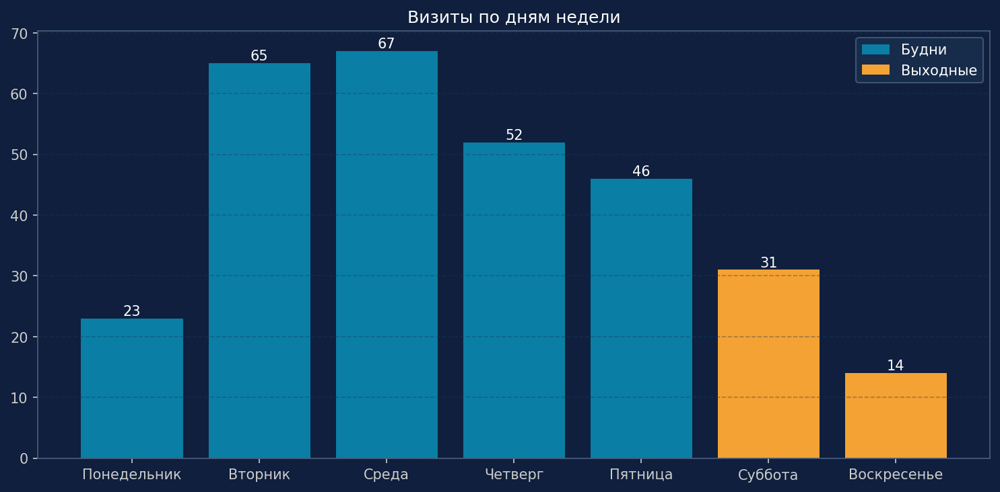
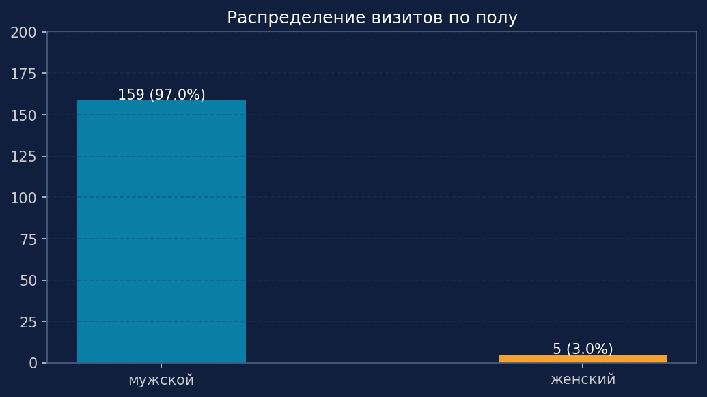
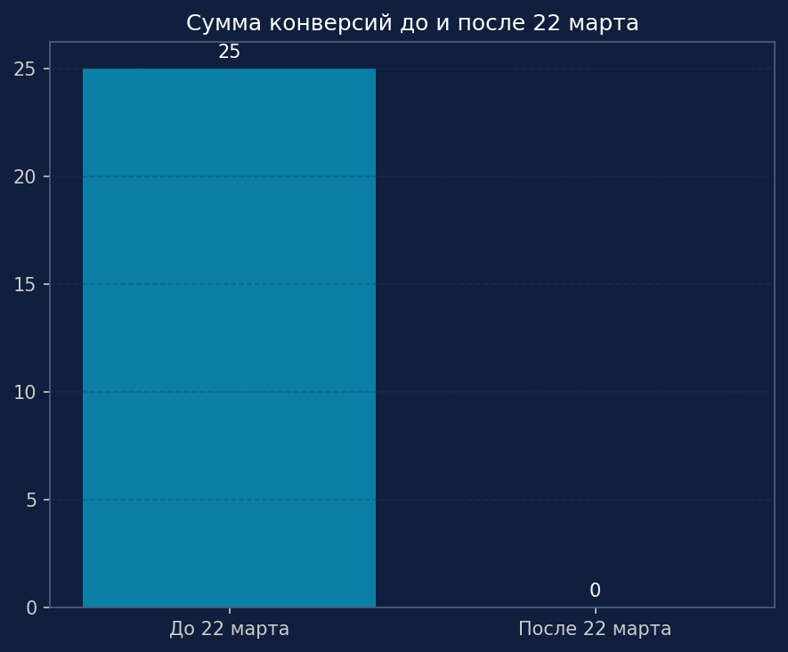
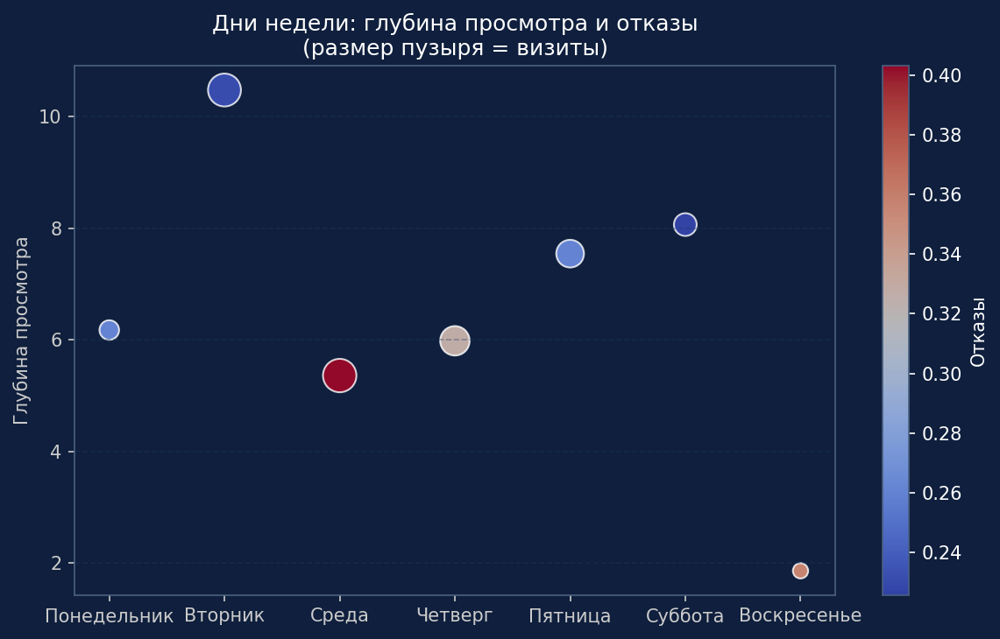

# продуктовая аналитика

# 📊 Kordo Analytics — визуализация и анализ метрик сайта.

Проект из портфолио продуктового аналитика: автоматизированная обработка выгрузки из Яндекс.Метрики и построение наглядных дашбордов на Python с тёмной темой.

## 🎯 Цель  Показать, как можно заменить Excel‑расчёты кодом, создать профессиональную визуализацию

## 📊 Визуализации (автоматически генерируются).

